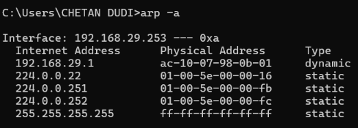

-->ARP: Address Resolution protocol
    1: ARP (Address Resolution Protocol): Protocol used to find the MAC address 
          corresponding to an IPv4 address within the local network.
        -> Works between Network Layer (IP) and Data Link Layer (MAC).
        -> ARP is used only on the local network/subnet; it does not work across the 
           Internet.
        -> Main purpose: IPv4 Address → MAC Address

    2: Why ARP is needed:
        -> IP address identifies the destination logically.
        -> MAC address is required to deliver an Ethernet frame on the local network.
        -> Therefore, when A knows B's IP but needs B's MAC, A uses ARP.

    3: IP Address:
        -> Logical address used for communication and routing between networks.
        -> Can change when a device changes networks.
        -> Example: 192.168.1.20

    4: MAC Address:
        -> Layer-2 address used for communication on the local network/link.
        -> Usually associated with a network interface.
        -> Different network interfaces can have different MAC addresses on the same 
           device.
        -> Example: A4:5E:60:12:34:56

    5: ARP Cache: Device stores recently learned mappings: IP Address → MAC Address
        -> Example: 192.168.1.20 → A4:5E:60:12:34:56
        -> Entries are temporary and age/expire.
        -> This avoids sending an ARP request every time.

    6: ARP Request:
        -> If the required IP→MAC mapping is not in the ARP cache, the device broadcasts 
           an ARP Request: "Who has 192.168.1.20?"
        -> Destination MAC: FF:FF:FF:FF:FF:FF
        -> All devices on the local LAN receive it.

    7: ARP Reply:
        -> The device whose IP matches the requested IP sends an ARP Reply containing its 
           MAC address: B: "192.168.1.20 is at A4:5E:60:12:34:56"
        -> ARP Reply is normally unicast to the requesting device.

    8: Same Subnet Communication:
        -> A compares its network ID with B's network ID using the subnet mask.
            A IP AND Mask → A Network ID
            B IP AND Mask → B Network ID
        -> If both network IDs are the same:
            A → ARP for B's MAC → B

    9: Different Subnet Communication:
        -> If network IDs are different, A cannot directly deliver the Ethernet frame to B
            A → Default Gateway → Other Networks → B
        -> A uses ARP to find the gateway's MAC, not B's MAC.
            A → ARP → Gateway IP → Gateway MAC
        -> Router then forwards the IP packet toward B.

    10: MAC vs IP during routing:
        -> Destination IP generally remains the final destination IP while the packet 
           travels through routers.
    -> MAC addresses change at every Layer-2 network/link.
    -> Each router removes the incoming Ethernet frame and creates a new frame for the 
       next link.

    11: Important ARP Flow:
        Application Data
        ↓
        Destination IP determined
        ↓
        Compare source & destination networks using subnet mask
        ↓
        Same subnet? → ARP for destination MAC
        Different subnet? → ARP for default gateway MAC
        ↓
        Create Ethernet Frame
        ↓
        Transmit

    12: Important Points:
        -> ARP maps IPv4 → MAC.
        -> ARP does not map MAC → IP in its normal operation.
        -> ARP Request = Broadcast.
        -> ARP Reply = Normally unicast.
        -> ARP is local-link only.
        -> ARP cache stores learned IP-MAC mappings temporarily.
        -> A stale ARP entry can expire and be resolved again.
        -> MAC addresses are relevant to the current local link; IP addresses provide 
           logical addressing across networks.

-->Command: Use command "arp -a" to view the ARP table fo your device
    
