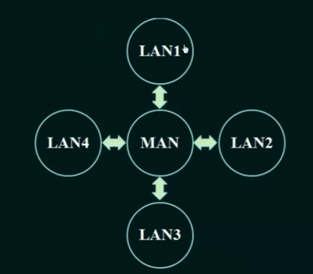
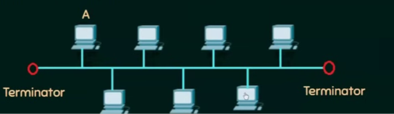
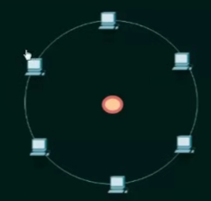
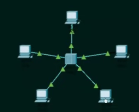
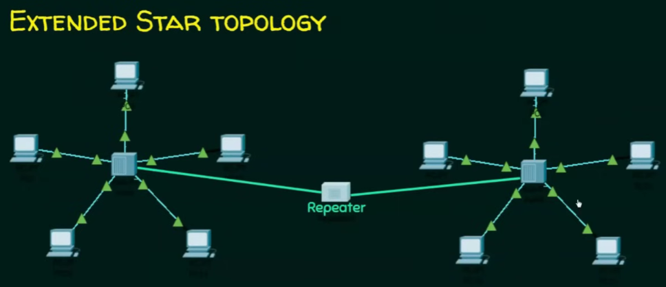
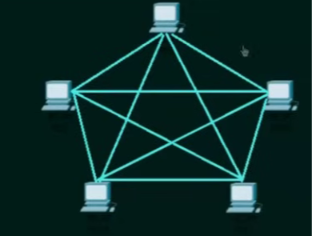

-->Computer Network: It is a set of nodes connected by communication links.

-->Node: A node is an element/device which is capable of sending or receiving data to/from another node.

-->Communication link: It can be wired/wireless and it is able to send the information from one node to another nodes.

-->Basic Characteristics of Computer Network:
(i):Fault Tolerance: It is the ability to continue working despite failures. It should ensure no loss of service.

(ii):Quality Of Service (QoS): It is the ability to set priorities and manage traffic to reduce data loss, delays, etc.

(iii):Security: It is the ability to prevent unauthorised access, misuse, forgery and the ability to provide confidentiality, Integrity and Availability.

(iv):Scalibility: It is the ability to grow network based on the need and have good performance after growth.

-->Data Flow Methods:
(i):Simplex: It is always one way flow of the data between nodes. 
(ii):Half Duplex: In this method, at a time only device can send data while the other will recieve it, but both can send data at different times.
(iii):Full Duplex:In this method, both nodes can send and receives data simultaneously.

--> Protocols: These are the rules that govern communication between two or more communicating entities.
(i): Message Format: Defines the structure/format of messages exchanged.
(ii): Message Order: Defines the order in which messages are exchanged.
(iii): Message Encoding/Representation: Defines how information is represented or encoded for transmission.
(iv): Message Timing: Defines when messages should be sent, when responses are expected, and what happens after a timeout.
(v): Message Size: Defines the maximum/minimum size of a message.
(vi): Actions: Defines what actions should be taken when a message is sent/received or another event occurs.
(vii): Purpose: Ensures that communicating devices understand each other and can successfully exchange information.
(viii): Message Delivery Options:
    (a): Unicast: One sender → one specific receiver.
    Address: Receiver's individual address.
    IPv4: 32 bits | MAC: 48 bits.
    (b): Multicast: One sender → multiple receivers belonging to a particular group.
    Address: One group address identifies the multicast group.
    IPv4: 32-bit address, with 28 bits of multicast address space (224.0.0.0–239.255.255.255) | MAC: 48 bits.
    (c): Broadcast: One sender → all receivers within the relevant broadcast domain.
    IPv4: 32 bits; 255.255.255.255 is the limited broadcast address.
    MAC: 48 bits; FF:FF:FF:FF:FF:FF.

IPv6: Does not use broadcast; multicast is used instead.

-->Computer Network Architectures:
(i):Client-Server Architecture: In a client-server architecture, there is an always-on server that provides services to many clients.

             Server
          (Always ON)
          /    |    \
         /     |     \
      Client Client Client

The clients send requests to the server, and the server sends responses back.
-->For example, when you open a website:
    Browser (Client) ── Request ──> Web Server
    Browser (Client) <── Response ── Web Server

The server is always on.
The server has a fixed, well-known IP address, so clients know where to contact it.
Clients normally don't directly communicate with one another; communication goes through the server.

-->Examples of Client Server Architecture: Web, FTP, Telnet, E-mail
-->Problem with Client-Server Architecture:
    A major issue is server scalability.
    If millions of clients simultaneously request services, one server may not be able to handle them. Therefore, large services use data centers containing many servers to act as a powerful virtual server.

(ii): Peer-to-Peer (P2P) Architecture: In a P2P architecture, there is little or no dependence on dedicated servers.
Instead, computers called peers communicate directly with other peers.

        Peer
       /    \
      /      \
   Peer ---- Peer
     \        /
      \      /
        Peer

-->Each peer can act as both:
    Client → requesting data
    Server → providing data

-->For example, in BitTorrent, you download pieces of a file from other peers while simultaneously uploading pieces to other peers.

The peers are typically users' computers such as desktops and laptops, and they can join or leave the system. This is why P2P systems have to deal with peer churn—peers coming and going.
Main advantage: Self-scalability

-->In client-server:
        More clients
            ↓
        More work for server
            ↓
        Server becomes bottleneck

-->In P2P:
        More peers
            ↓
        More requests
            +
        More peers providing data
            ↓
        More service capacity

-->Self-scalability: When a new peer joins, it not only creates demand but can also contribute upload capacity to the system. 

-->Types of Computer Networks:
1. LAN — Local Area Network: A LAN (Local Area Network) connects devices within a small geographical area, such as: Home, Office, School, University/campus, Building
->LAN technologies such as Ethernet and Wi-Fi.
->Characteristics:
        Small geographical area
        Usually privately managed
        Generally high data rates
        Ethernet and Wi-Fi are common LAN technologies

2. MAN — Metropolitan Area Network: MAN (Metropolitan Area Network) covers a larger geographical area than a LAN, typically a city or metropolitan region.
->Think:
        Building A ───┐
                    │
        Building B ───┼── Metropolitan Network
                    │
        Building C ───┘

For example, a network connecting several university buildings or offices distributed across a city can be considered a metropolitan-scale network.

3. WAN — Wide Area Network: A WAN (Wide Area Network) covers a large geographical area, potentially connecting cities, countries, or continents.

    City A
      LANs
       |
       | WAN
       |
       ↓
    City B
      LANs
       |
       | WAN
       |
       ↓
    City C
      LANs

The Internet is the most prominent example of a global wide-area network/network of networks.

-->The Internet: It is a network of networks, consisting of access ISPs, regional ISPs, tier-1 ISPs, etc., interconnected across large geographic areas.

-->Cloud Computing: It is the on-demand delivery of computing resources, such as servers, storage, databases, and applications, over the Internet, which can be obtained and released as needed.

-->Network Topology: It is the arrangement of nodes in a network.
    1: Bus Toplogy: It has a common transmission medium and all nodes are connected to  
                    this common transmission medium.
                    ->If a node wants to send data to other node, then a copy will be sent 
                    to all nodes because they shared the same transmission, all other can 
                    deny to accept this packet.
        ->Bus topology: All nodes share one common backbone cable.
        ->Transmission: A node sends a frame onto the shared bus; the signal propagates in 
                        both directions.
        ->Reception: All nodes can see the transmission; only the destination accepts it.
        ->After destination: The signal continues past the destination until it reaches 
                             the transmitter.
        ->Terminators: Present at both ends and absorb the signal to prevent reflection.
        ->Collision: Multiple nodes transmitting simultaneously can cause collisions.
        ->Traditional Ethernet: Used CSMA/CD to handle collisions.
        ->Advantages: Simple, less cable, no central device.
        ->Disadvantages: Collisions, difficult troubleshooting, backbone failure affects 
                          communication, poor scalability, not fault tolerant.
        ->Broadcast: It basically broadcast the message as it sends signals to all nodes.

                 
    2: Ring Topology: It is a topology in which each node is connected to exactly two    
                      other nodes, forming a closed circular path.
                        ->Data travels from one node to the next around the ring.
        ->Transmission: A node sends data to the next connected node, and the data is 
                        forwarded from node to node.
        ->Reception: Each node checks the destination address; if it is not the 
                     destination, it forwards the data to the next node.
        ->Direction: Data may travel in one direction (**unidirectional**) or both 
                     directions (**bidirectional**) depending on the ring design.
        ->Token Ring: A token may be passed around the ring, and only the node holding the 
                      token can transmit data.
        ->Collision: Token-based ring networks avoid collisions because only the node 
                     holding the token transmits.
        ->Failure: Failure of a single node or link can interrupt the entire ring in a 
                   basic ring topology.
        ->Advantages: No collisions in token-based systems, orderly access, and equal 
                      opportunity for nodes to transmit.
        ->Disadvantages: Failure can affect the whole network, adding/removing nodes can 
                         be difficult, and troubleshooting is harder.
        ->Fault Tolerance: A **dual-ring** topology can provide better fault tolerance 
                           because data can use the other ring if one path fails.
        ->Bottleneck: A link can cause bottleneck it any of the link is a weak link.

    3: Star Topology: It is a topology in which all nodes are directly connected to a
                      central device such as a switch or hub.
                        ->Each node has a separate connection to the central device.
        ->Transmission: A node sends data to the central device, which forwards the data 
                        to the destination node.
        ->Central Device: The switch/hub acts as the central point connecting all nodes.
        ->Reception: In a switched network, the switch forwards the frame only to the 
                     required destination port. So, other nodes didn't receive any copy.
        ->Failure: Failure of one connecting cable affects only that particular node, but 
                   failure of the central device can affect the entire network.
        ->Collision: In modern switched Ethernet, collisions are generally avoided because 
                     each link is a separate point-to-point connection.
        ->Advantages: Easy to install, easy to manage, easy troubleshooting, scalable, and 
                      fault isolation is simple.
        ->Disadvantages: Requires more cable, depends on the central device, and failure 
                         of the central device can bring down the network.

 

    4: Mesh Topology: It is a topology in which nodes are connected to multiple or all 
                      other nodes, providing multiple paths for data transmission.
                        ->It can be **full mesh** or **partial mesh**.
        ->Full Mesh: Every node is directly connected to every other node.
        ->Partial Mesh: Only some nodes are directly connected to multiple other nodes.
        ->Transmission: Data can travel through different paths from source to 
                        destination.
        ->Fault Tolerance: If one link fails, data can use another available path.
        ->Reliability: Very reliable because multiple paths are available between nodes.
        ->Cost: Requires more cables, ports, and hardware, especially in a full mesh.
        ->Advantages: High reliability, fault tolerance, dedicated links, and good 
                      privacy/security.
        ->Disadvantages: Expensive, complex installation, difficult maintenance, and 
                         requires many connections.
        ->Full Mesh Connections: For n nodes, the number of direct links required is 
                                 n(n−1)/2.

