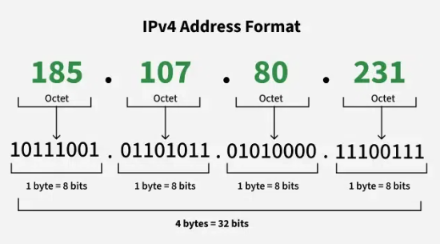
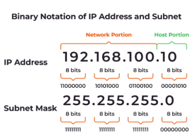

-->IP stands for Internet Protocol
-->Every device is identified uniquely with the help of IP address
-->IP is the virtual/logical address for a node and can be changed based on the location
-->TP addresses can be assigned manually or dynamically 
-->IPv4 has 32 bits(4 Bytes) and range from 0.0.0.0 to 255.255.255.255 where each octet has 8 bits
-->Use command: ipconfig -> to view the IP address of the device
-->Ex: 127.0.01, 10.0.0.1, 255.255.255.255, 0.0.0.0, 192.127.98.235, etc.

-->Network Address and Host Address:
    In an IPv4 address, the 32 bits are divided into two logical parts:
        1. Network Portion: Identifies the network to which the device belongs.
        2. Host Portion: Identifies the specific device (host) within that network.
    For example: 192.168.1.10/24
        Network portion | Host portion
        192.168.1       | 10
        24 bits         | 8 bits
    So:
        IPv4 address = 32 bits
        Network bits = 24 bits
        Host bits = 8 bits
        /24 is the prefix length, telling us that the first 24 bits represent the network.
    ->Important:The number of network bits and host bits is not always fixed. It depends 
                on the subnet mask/prefix length.
    ->For /n: Network bits = n, Host bits = 32 − n
        Examples:
            /8 → 8 network bits + 24 host bits
            /16 → 16 network bits + 16 host bits
            /24 → 24 network bits + 8 host bits
    ->Summary: IPv4 address contains 32 bits and divided as:
        (i): Network Portion: Identifies the network.
        (ii): Host Portion: Identifies a particular device within that network.
        ->Network Bits: Determined by the prefix length.
        ->Host Bits: 32 − Network bits.
        ->Example: /24 → 24 network bits + 8 host bits.

-->Subnet Mask: A subnet mask is a 32-bit value used with an IPv4 address to identify 
                which bits belong to the network portion and which bits belong to the host 
                portion.
    -> Network bits: Represented by 1 in the subnet mask.
    -> Host bits: Represented by 0 in the subnet mask.
    -> Example: 192.168.1.10/24
            Subnet mask: 255.255.255.0
            Binary: 11111111.11111111.11111111.00000000
            First 24 bits = Network
            Last 8 bits = Host
    -> Purpose: It tells a device which part of an IP address identifies the network and 
                which part identifies the host.
    ->Summary:
        (i): Subnet Mask: Separates network and host portions of an IPv4 address.
        (ii): 1s: Network portion.
        (iii): 0s: Host portion.
        (iv): IPv4: Subnet mask is 32 bits.
        (v): /24: 24 network bits + 8 host bits.
        (vi): /24 Mask: 255.255.255.0

-->CIDR Notation: Classless Inter Domain Routing: The above used notation is CIDR Notation

-->How Subnet Mask Finds Same/Different Network:
    -> The source device performs a bitwise AND operation between the source IP address 
       and subnet mask to obtain the source network address.
    -> It performs the same AND operation between the destination IP address and subnet 
       mask to obtain the destination network address.
    -> If both network addresses are same → Source and destination are on the same \
       network.
    -> If network addresses are different → They are on different networks.

-->Data Delivery Decision:
    -> Same Network: Device sends data directly to the destination through the local 
                     network.
    -> Different Network: Device sends data to the default gateway/router, which forwards 
                          it toward the destination network.
    -> Internet is not required for communication between devices on the same local 
       network.

-->Default Gateway: A default gateway is the router/device through which a host sends data 
                    when the destination is outside its own network.
    -> Same Network: Data is sent directly to the destination device.
    -> Different Network: Data is sent to the default gateway, which is usually the 
                          router.
    -> Why needed: A host can communicate directly within its local network, but it needs 
                   a router to reach other networks.
    -> Example:
        -> PC IP: 192.168.1.10
        -> Subnet Mask: 255.255.255.0
        -> Default Gateway: 192.168.1.1
        -> If destination = 192.168.1.20 → same network → direct delivery.
        -> If destination = 8.8.8.8 → different network → send to 192.168.1.1 (gateway) 
                             router forwards it.
    ->Summary:
        (i): Default Gateway: Router/device used to reach other networks.
        (ii): Same Network: Send data directly.
        (iii): Different Network: Send data to default gateway.
        (iv): Usually: Default gateway is the local router's IP address.
        (v): Main Role: Provides the path from the local network to other 
                        networks/Internet.